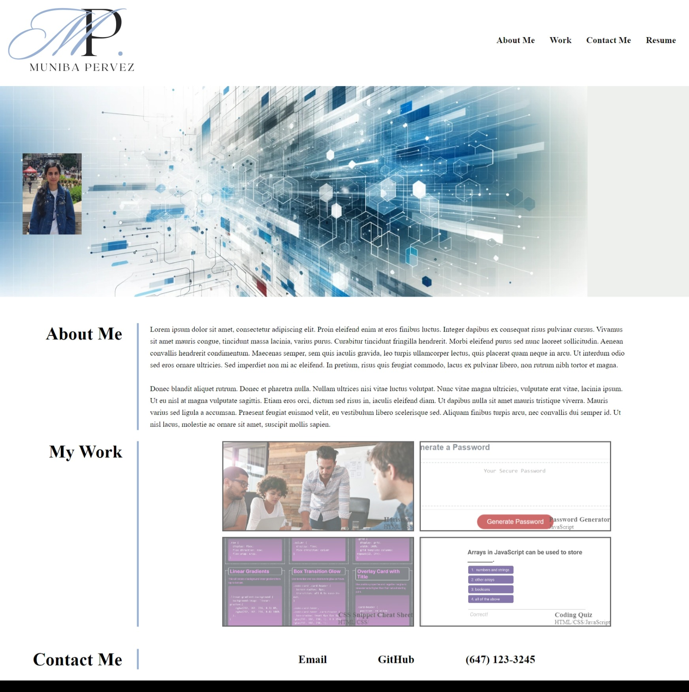

# Challenge_2_My_Portfolio

## Description

In this week challenge #2, as a beginner web developer I was tasked to build a portfolio page. In the web development industry, a portfolio is a vital tool that showcase our technical skills and projects through interactive examples, demonstrating our proficiency in creating functional and visually appealing web applications. In addition, a work portfolio can effectively demonstrates our abilities and expertise to employers seeking to hire for part-time or full-time roles. It not only showcases our best work but also the reasoning and strategy behind it. Students who possess portfolios featuring web applications that are live and operational often find great success in their job search after completion of their boot camp.                                               

## Acceptance Criteria

Some critical requirements necessary to develop a portfolio that satisfies a typical hiring manager’s needs:

GIVEN I need to sample a potential employee's previous work

WHEN I load their portfolio

THEN I am presented with the developer's name, a recent photo or avatar, and links to sections about them, their work, and how to contact them

WHEN I click one of the links in the navigation

THEN the UI scrolls to the corresponding section

WHEN I click on the link to the section about their work

THEN the UI scrolls to a section with titled images of the developer's applications

WHEN I am presented with the developer's first application

THEN that application's image should be larger in size than the others

WHEN I click on the images of the applications

THEN I am taken to that deployed application

WHEN I resize the page or view the site on various screens and devices

THEN I am presented with a responsive layout that adapts to my viewport

## Technologies

The technologies I used in this challenge includes:
1. HTML: the HTML file was created providing the structure and content of a webpage, defining elements like text, images, and links through markup tags.
2. CSS: the CSS file was created that includes the styling and appearance of the HTML elements, controlling the layout, colors, fonts, and overall visual presentation. Also, it includes media queries for responsive web design for all devices.
3. Github: Gibhub was used to create a repository which includes the links to the projects, assets folder, and the README file.
4. Giblab: Giblab was used to clone the project to our laptop.

To clone: git clone https://github.com/your-username/repository-name.git

## Technical Acceptance Criteria: 40%

* Satisfies all of the above acceptance criteria.

### Deployment: 32%

* Application deployed at live URL.

* Application loads with no errors.

* Application GitHub URL submitted.

* GitHub repository contains application code.

### Application Quality: 15%

* Application resembles the mock-up functionality provided in the Challenge instructions.

### Repository Quality: 13%

* Repository has a unique name.

* Repository follows best practices for file structure and naming conventions.

* Repository follows best practices for class/id naming conventions, indentation, quality comments, etc.

* Repository contains multiple descriptive commit messages.

* Repository contains quality readme with description, screenshot, link to deployed application.

## Screenshot

## Resources

[W3schools_CSS Variables](https://www.w3schools.com/css/css3_variables.asp)

[MDN web docs_Media Queries](https://developer.mozilla.org/en-US/docs/Web/CSS/CSS_media_queries/Using_media_queries)

## Links

[GitHub Repository link](https://github.com/MunibaP/Challenge_2_My_Portfolio.git)

[Deployment link](https://munibap.github.io/Challenge_2_My_Portfolio/)

## License

Redistribution of the CVW software or derived works must reproduce MITRE's copyright designation and this License in the documentation and/or other materials provided with the distribution.Copyright © 1994-1999. The MITRE Corporation (http://www.mitre.org/). All Rights Reserved.
